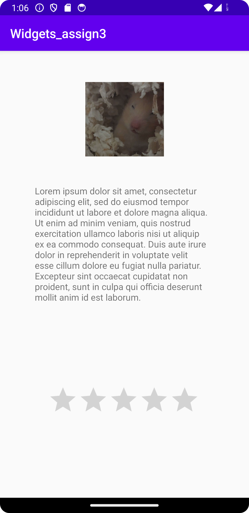

# Rapport

Använda mig av en constraint layout, skapade 3 widgets; ratingBar, 
imageView och textView, använde mig av olika constraint genom
dra deras sidor längst med applikationens sidor, vilket resulterade i många
``app:layout_constraint<XXXX>="parent"`` men respektive widget fick också en 
``app:layout_constraintVertical_bias="<XXXX>"`` för att inte vara centrerade 
i mitten allihopa.
Skapade en sträng med Lorem-text för textView-widget, skapade en drawable 
av hamstern Klemens för användning i imageView.


Skärmdump färdig produkt:



```
function errorCallback(error) {
    switch(error.code) {
        case error.PERMISSION_DENIED:
            // Geolocation API stöds inte, gör något
            break;
        case error.POSITION_UNAVAILABLE:
            // Misslyckat positionsanrop, gör något
            break;
        case error.UNKNOWN_ERROR:
            // Okänt fel, gör något
            break;
    }
}
```


